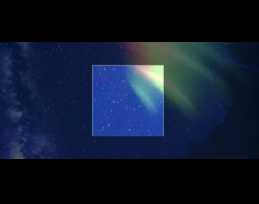

# canvas-image-cropper

JavaScript image cropper based on canvas



# 安装

```
npm install canvas-image-cropper
```


# 使用

```
<div id="container"></div>

var canvasImageCropper = new CanvasImageCropper({
    canvasWidth: 500,
    canvasHeight: 500,
    maskStyle: 'rgba(0, 0, 0, .6)',
    clipWidth: 200,
    clipHeight: 200
});
canvasImageCropper.render(document.getElementById('container'), './foo.jpg');
```

# 参数说明

```
canvasWidth  -- canvas 的大小 图片绘制宽度不会超过这个值
canvasHeight  -- canvas 的大小 图片绘制高度不会超过这个值
maskStyle  -- 遮罩样式
clipWidth  -- 裁剪像素大小
clipHeight  -- 裁剪像素大小
```

# API

1. 获取裁剪坐标

```
canvasImageCropper.getClipPosition()

{ x: 0, y: 0, width: 200, height: 200 }
```

2. 获取裁剪区 base64 数据

```
canvasImageCropper.getPreview()
```